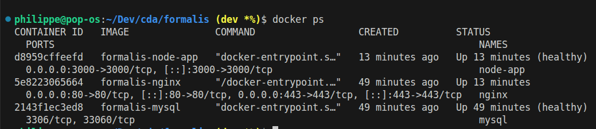
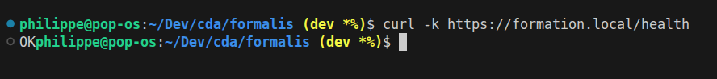
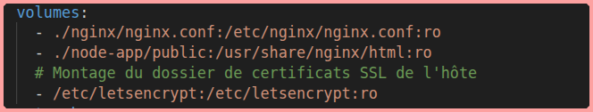
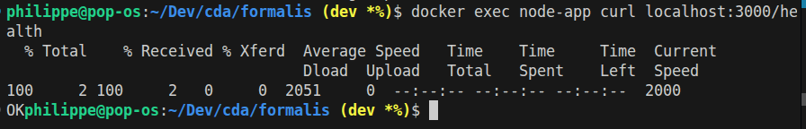
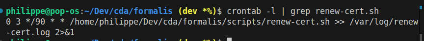
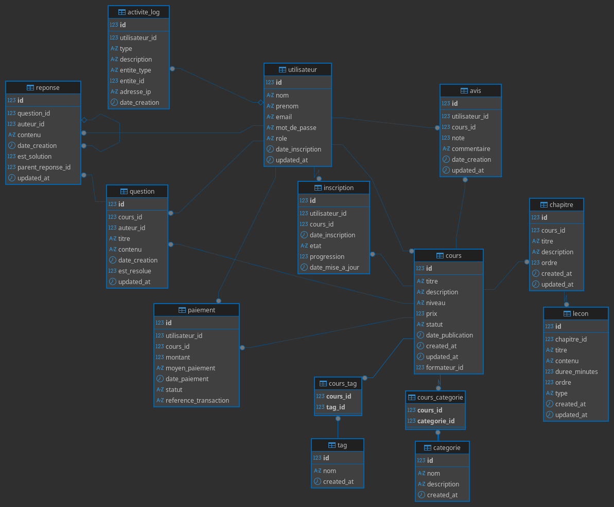

# Rapport de validation

## 1. Démarrage des conteneurs

- Commande : `docker-compose up -d`
- Vérification :
  - `docker ps` montre les conteneurs node-app, mysql, nginx en statut Up
 

## 2. Test de l’API via HTTPS

- Commande : `curl -k https://formation.local/health`
- Résultat attendu : `OK`

## 3. Vérification du reverse proxy NGINX

- NGINX expose les ports 80/443
- Redirige bien vers node-app
- Certificats montés depuis /etc/letsencrypt

## 4. Connexion Node ↔ MySQL

- Test de connexion effectué dans node-app
- Résultat : OK ou message d’erreur explicite

## 5. Renouvellement automatique du certificat

- Script Bash présent dans scripts/renew-cert.sh

## 6. Accès à la base de données via DBeaver

- Connexion réussie à la base MySQL via DBeaver (localhost:3306)
- Paramètre JDBC utilisé : `allowPublicKeyRetrieval=true`

